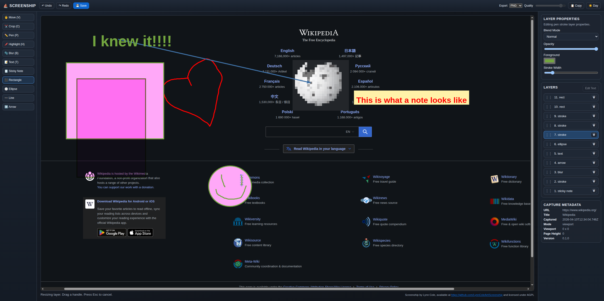
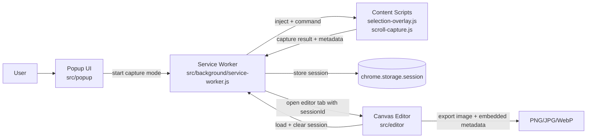
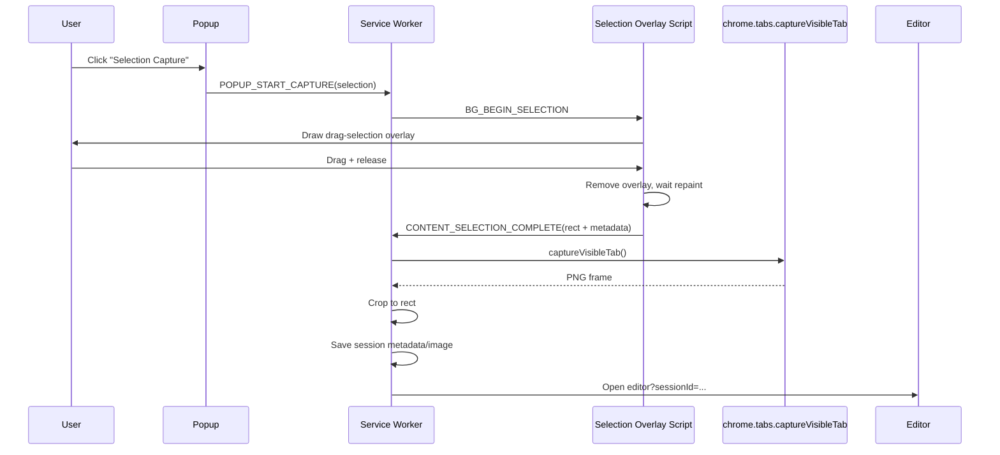
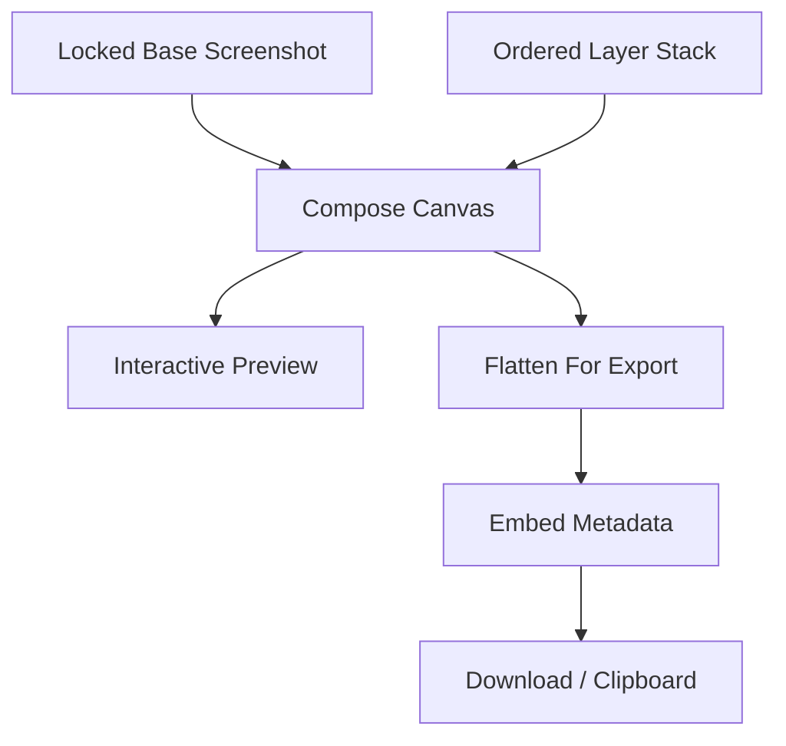

# ⛵ ScreenShip

ScreenShip exists because screenshot tools in Chrome kept hitting the same two walls:

1. They were flaky, clunky, or missing obvious basics.
2. They worked... until the useful part was locked behind a subscription.

This project is the opposite of that.

## The Promise

ScreenShip will **never** require a subscription for core screenshot + edit functionality.

- No feature paywall for basic editing.
- No "trial mode" lockout for tools you genuinely need.
- No cloud account required for capture/edit/export.

If people want to support the work, donations are welcome. Paying for open source is a love language, and we appreciate it.

## Screenshot Of ScreenShip Taking A Screenshot



## What It Does Today

- Selection capture
- Scrolling full-page capture
- Editor with layers + move/resize
- Crop, pen, highlight, blur, text, sticky notes, and shape primitives
- Layer flattening to final image output
- Export to PNG, JPG, and WebP
- Metadata embedding with source URL and capture timestamps
- Dark/light UI toggle (dark default)

## Architecture At A Glance



## Capture Sequence (Selection Mode)



## Editor Rendering Model



## Technical Notes

### Message Contracts

Cross-context communication is centralized in `src/shared/messages.js`.
This keeps popup, background worker, content scripts, and editor loosely coupled but deterministic.

### Session Lifecycle

1. Capture starts from popup.
2. Background orchestrates content script operations and frame capture.
3. Result is stored as an editor session (`sessionId`).
4. Editor loads session once and requests cleanup.

### Layer Model

Layer constructors live in `src/editor/layer-model.js`. Layer kinds currently include:

- `stroke`
- `highlight`
- `shape` (`rect`, `ellipse`, `line`, `arrow`)
- `text` (including sticky note mode)
- `blur`

Each layer supports opacity and blend mode, and is rendered in stack order.

### Export + Metadata

Export metadata is built in `src/shared/metadata.js` and embedded in:

- PNG via `iTXt`
- JPG via XMP APP1
- WebP via XMP chunk

Included fields can contain source URL, title, capture timestamp, viewport/page dimensions, mode, and extension version.

## Local-First Privacy Stance

- Capture/edit/export flow is local.
- No required backend service.
- No account required.

Always review `manifest.json` permissions during release prep.

## Run The Extension (Unpacked)

1. Open `chrome://extensions`.
2. Enable **Developer mode**.
3. Click **Load unpacked**.
4. Select this repository.
5. Pin ScreenShip and launch it from the toolbar.

## Repo Layout

- `manifest.json`: MV3 extension definition
- `docs/spec.md`: Product and engineering spec
- `docs/manual-qa.md`: Manual QA and stitch tuning notes
- `src/background`: Capture orchestration + session management
- `src/content`: Selection overlay and full-page scroll capture logic
- `src/editor`: Canvas editor UI, interaction logic, and layer rendering
- `src/popup`: Extension action popup UI
- `src/shared`: Message contracts and metadata helpers
- `scripts/verify-metadata.js`: Metadata inspection helper

## Useful Commands

Verify embedded metadata:

```bash
node scripts/verify-metadata.js /path/to/exported-image.png
```

Syntax check all JS:

```bash
find src -name '*.js' -print0 | xargs -0 -n1 node --check
```

## License

Licensed under the GNU Affero General Public License v3.0 (`AGPL-3.0`).
See [LICENSE](LICENSE).

## Where To Improve Next

If we want to level this up from "great" to "ridiculously good," the highest-value next steps are:

1. Add automated end-to-end tests for capture -> edit -> export flows.
2. Harden full-page stitch behavior for sticky/fixed elements and dynamic feeds.
3. Add keyboard-first editing ergonomics (nudge, duplicate, lock layer, quick color swaps).
4. Improve text engine parity further (selection, multiline edit affordances, richer typography controls).
5. Add release tooling for Chrome Web Store packaging and policy checks.
